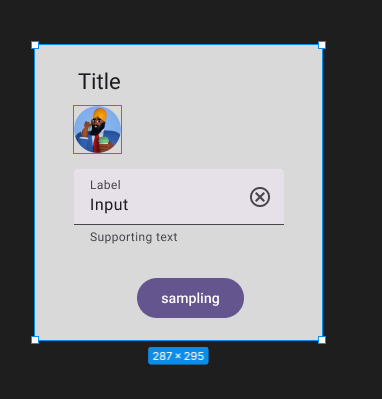
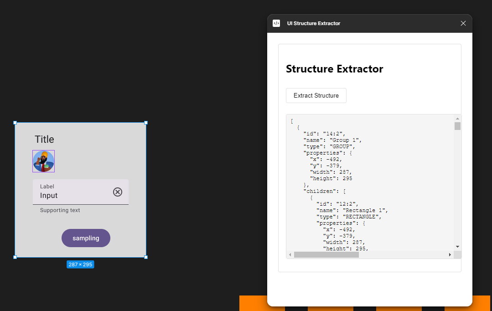

Below are the steps to get your plugin running. You can also find instructions at:

  https://www.figma.com/plugin-docs/plugin-quickstart-guide/

This plugin template uses Typescript and NPM, two standard tools in creating JavaScript applications.

First, download Node.js which comes with NPM. This will allow you to install TypeScript and other
libraries. You can find the download link here:

  https://nodejs.org/en/download/

Next, install TypeScript using the command:

  npm install -g typescript

Finally, in the directory of your plugin, get the latest type definitions for the plugin API by running:

  npm install --save-dev @figma/plugin-typings

If you are familiar with JavaScript, TypeScript will look very familiar. In fact, valid JavaScript code
is already valid Typescript code.

TypeScript adds type annotations to variables. This allows code editors such as Visual Studio Code
to provide information about the Figma API while you are writing code, as well as help catch bugs
you previously didn't notice.

For more information, visit https://www.typescriptlang.org/

Using TypeScript requires a compiler to convert TypeScript (code.ts) into JavaScript (code.js)
for the browser to run.

We recommend writing TypeScript code using Visual Studio code:

1. Download Visual Studio Code if you haven't already: https://code.visualstudio.com/.
2. Open this directory in Visual Studio Code.
3. Compile TypeScript to JavaScript: Run the "Terminal > Run Build Task..." menu item,
    then select "npm: watch". You will have to do this again every time
    you reopen Visual Studio Code.

That's it! Visual Studio Code will regenerate the JavaScript file every time you save.

[
  {
    "id": "14:2",
    "name": "Group 1",
    "type": "GROUP",
    "properties": {
      "x": -492,
      "y": -379,
      "width": 287,
      "height": 295
    },
    "children": [
      {
        "id": "12:2",
        "name": "Rectangle 1",
        "type": "RECTANGLE",
        "properties": {
          "x": -492,
          "y": -379,
          "width": 287,
          "height": 295,
          "fills": [
            {
              "type": "SOLID",
              "visible": true,
              "opacity": 1,
              "blendMode": "NORMAL",
              "color": {
                "r": 0.8509804010391235,
                "g": 0.8509804010391235,
                "b": 0.8509804010391235
              },
              "boundVariables": {}
            }
          ]
        }
      },
      {
        "id": "23:2303",
        "name": "Button",
        "type": "INSTANCE",
        "properties": {
          "x": -390,
          "y": -146,
          "width": 107,
          "height": 40,
          "fills": [
            {
              "type": "SOLID",
              "visible": true,
              "opacity": 1,
              "blendMode": "NORMAL",
              "color": {
                "r": 0.3960784375667572,
                "g": 0.3333333432674408,
                "b": 0.5607843399047852
              },
              "boundVariables": {
                "color": {
                  "type": "VARIABLE_ALIAS",
                  "id": "VariableID:4dd2e1d0ca4752a2c0899dfcb773cd35f0e884b4/57299:22461"
                }
              }
            }
          ]
        },
        "children": [
          {
            "id": "I23:2303;53923:27634",
            "name": "state-layer",
            "type": "FRAME",
            "properties": {
              "x": 0,
              "y": 0,
              "width": 107,
              "height": 40,
              "fills": []
            },
            "children": [
              {
                "id": "I23:2303;53923:27635",
                "name": "label-text",
                "type": "TEXT",
                "properties": {
                  "x": 24,
                  "y": 10,
                  "width": 59,
                  "height": 20,
                  "fills": [
                    {
                      "type": "SOLID",
                      "visible": true,
                      "opacity": 1,
                      "blendMode": "NORMAL",
                      "color": {
                        "r": 1,
                        "g": 1,
                        "b": 1
                      },
                      "boundVariables": {
                        "color": {
                          "type": "VARIABLE_ALIAS",
                          "id": "VariableID:3bbfcb83714f26e09e9946ff91dfc27160a0b7f4/57299:22455"
                        }
                      }
                    }
                  ]
                }
              }
            ]
          }
        ]
      },
      {
        "id": "23:2339",
        "name": "Title",
        "type": "TEXT",
        "properties": {
          "x": -449,
          "y": -355,
          "width": 43,
          "height": 28,
          "fills": [
            {
              "type": "SOLID",
              "visible": true,
              "opacity": 1,
              "blendMode": "NORMAL",
              "color": {
                "r": 0.11372549086809158,
                "g": 0.10588235408067703,
                "b": 0.125490203499794
              },
              "boundVariables": {
                "color": {
                  "type": "VARIABLE_ALIAS",
                  "id": "VariableID:01a110c88b76e61d3d5a19c3d949b934781cd139/57299:22441"
                }
              }
            }
          ]
        }
      },
      {
        "id": "23:1545",
        "name": "Text field",
        "type": "INSTANCE",
        "properties": {
          "x": -453,
          "y": -255,
          "width": 210,
          "height": 56,
          "fills": []
        },
        "children": [
          {
            "id": "I23:1545;52798:24375",
            "name": "Text field",
            "type": "FRAME",
            "properties": {
              "x": 0,
              "y": 0,
              "width": 210,
              "height": 56,
              "fills": [
                {
                  "type": "SOLID",
                  "visible": true,
                  "opacity": 1,
                  "blendMode": "NORMAL",
                  "color": {
                    "r": 0.9019607901573181,
                    "g": 0.8784313797950745,
                    "b": 0.9137254953384399
                  },
                  "boundVariables": {
                    "color": {
                      "type": "VARIABLE_ALIAS",
                      "id": "VariableID:a24662471a8683881ee036de9543822ab406f38b/57299:22376"
                    }
                  }
                }
              ]
            },
            "children": [
              {
                "id": "I23:1545;52798:24376",
                "name": "State-layer",
                "type": "FRAME",
                "properties": {
                  "x": 0,
                  "y": 0,
                  "width": 210,
                  "height": 56,
                  "fills": []
                },
                "children": [
                  {
                    "id": "I23:1545;52798:24377",
                    "name": "Content",
                    "type": "FRAME",
                    "properties": {
                      "x": 16,
                      "y": 4,
                      "width": 146,
                      "height": 48,
                      "fills": []
                    },
                    "children": [
                      {
                        "id": "I23:1545;52798:24378",
                        "name": "Label text container",
                        "type": "FRAME",
                        "properties": {
                          "x": 0,
                          "y": 4,
                          "width": 31,
                          "height": 16,
                          "fills": []
                        },
                        "children": [
                          {
                            "id": "I23:1545;52798:24379",
                            "name": "Label text",
                            "type": "TEXT",
                            "properties": {
                              "x": 0,
                              "y": 0,
                              "width": 31,
                              "height": 16,
                              "fills": [
                                {
                                  "type": "SOLID",
                                  "visible": true,
                                  "opacity": 1,
                                  "blendMode": "NORMAL",
                                  "color": {
                                    "r": 0.2862745225429535,
                                    "g": 0.2705882489681244,
                                    "b": 0.30980393290519714
                                  },
                                  "boundVariables": {
                                    "color": {
                                      "type": "VARIABLE_ALIAS",
                                      "id": "VariableID:8e5b2e6c392c81769e0f26710c9a55ace5b2bc71/57299:22433"
                                    }
                                  }
                                }
                              ]
                            }
                          }
                        ]
                      },
                      {
                        "id": "I23:1545;52798:24380",
                        "name": "Input text container",
                        "type": "FRAME",
                        "properties": {
                          "x": 0,
                          "y": 20,
                          "width": 146,
                          "height": 24,
                          "fills": []
                        },
                        "children": [
                          {
                            "id": "I23:1545;52798:24381",
                            "name": "Input text",
                            "type": "TEXT",
                            "properties": {
                              "x": 0,
                              "y": 0,
                              "width": 146,
                              "height": 24,
                              "fills": [
                                {
                                  "type": "SOLID",
                                  "visible": true,
                                  "opacity": 1,
                                  "blendMode": "NORMAL",
                                  "color": {
                                    "r": 0.11372549086809158,
                                    "g": 0.10588235408067703,
                                    "b": 0.125490203499794
                                  },
                                  "boundVariables": {
                                    "color": {
                                      "type": "VARIABLE_ALIAS",
                                      "id": "VariableID:01a110c88b76e61d3d5a19c3d949b934781cd139/57299:22441"
                                    }
                                  }
                                }
                              ]
                            }
                          }
                        ]
                      }
                    ]
                  },
                  {
                    "id": "I23:1545;52798:24382",
                    "name": "Trailing icon",
                    "type": "INSTANCE",
                    "properties": {
                      "x": 162,
                      "y": 4,
                      "width": 48,
                      "height": 48,
                      "fills": []
                    },
                    "children": [
                      {
                        "id": "I23:1545;52798:24382;51525:5219",
                        "name": "container",
                        "type": "FRAME",
                        "properties": {
                          "x": 4,
                          "y": 4,
                          "width": 40,
                          "height": 40,
                          "fills": []
                        },
                        "children": [
                          {
                            "id": "I23:1545;52798:24382;51525:5220",
                            "name": "state-layer",
                            "type": "FRAME",
                            "properties": {
                              "x": 0,
                              "y": 0,
                              "width": 40,
                              "height": 40,
                              "fills": [
                                {
                                  "type": "SOLID",
                                  "visible": false,
                                  "opacity": 1,
                                  "blendMode": "NORMAL",
                                  "color": {
                                    "r": 1,
                                    "g": 1,
                                    "b": 1
                                  },
                                  "boundVariables": {}
                                }
                              ]
                            },
                            "children": [
                              {
                                "id": "I23:1545;52798:24382;51525:5221",
                                "name": "Icon",
                                "type": "INSTANCE",
                                "properties": {
                                  "x": 8,
                                  "y": 8,
                                  "width": 24,
                                  "height": 24,
                                  "fills": []
                                },
                                "children": [
                                  {
                                    "id": "I23:1545;52798:24382;51525:5221;54616:25504",
                                    "name": "icon",
                                    "type": "VECTOR",
                                    "properties": {
                                      "x": 1.9999998807907104,
                                      "y": 1.9999998807907104,
                                      "width": 20,
                                      "height": 20,
                                      "fills": [
                                        {
                                          "type": "SOLID",
                                          "visible": true,
                                          "opacity": 1,
                                          "blendMode": "NORMAL",
                                          "color": {
                                            "r": 0.2862745225429535,
                                            "g": 0.2705882489681244,
                                            "b": 0.30980393290519714
                                          },
                                          "boundVariables": {
                                            "color": {
                                              "type": "VARIABLE_ALIAS",
                                              "id": "VariableID:8e5b2e6c392c81769e0f26710c9a55ace5b2bc71/57299:22433"
                                            }
                                          }
                                        }
                                      ]
                                    }
                                  }
                                ]
                              }
                            ]
                          }
                        ]
                      }
                    ]
                  }
                ]
              }
            ]
          },
          {
            "id": "I23:1545;52798:24383",
            "name": "Active indicator",
            "type": "LINE",
            "properties": {
              "x": 0,
              "y": 56,
              "width": 210,
              "height": 0,
              "fills": []
            }
          },
          {
            "id": "I23:1545;52798:24384",
            "name": "Supporting text",
            "type": "FRAME",
            "properties": {
              "x": 0,
              "y": 56,
              "width": 210,
              "height": 20,
              "fills": [
                {
                  "type": "SOLID",
                  "visible": false,
                  "opacity": 1,
                  "blendMode": "NORMAL",
                  "color": {
                    "r": 1,
                    "g": 1,
                    "b": 1
                  },
                  "boundVariables": {}
                }
              ]
            },
            "children": [
              {
                "id": "I23:1545;52798:24385",
                "name": "supporting-text",
                "type": "TEXT",
                "properties": {
                  "x": 16,
                  "y": 4,
                  "width": 178,
                  "height": 16,
                  "fills": [
                    {
                      "type": "SOLID",
                      "visible": true,
                      "opacity": 1,
                      "blendMode": "NORMAL",
                      "color": {
                        "r": 0.2862745225429535,
                        "g": 0.2705882489681244,
                        "b": 0.30980393290519714
                      },
                      "boundVariables": {
                        "color": {
                          "type": "VARIABLE_ALIAS",
                          "id": "VariableID:8e5b2e6c392c81769e0f26710c9a55ace5b2bc71/57299:22433"
                        }
                      }
                    }
                  ]
                }
              }
            ]
          }
        ]
      }
    ]
  },
  {
    "id": "23:20",
    "name": "3D Avatars / 32",
    "type": "INSTANCE",
    "properties": {
      "x": -453,
      "y": -318,
      "width": 47,
      "height": 47,
      "fills": [
        {
          "type": "SOLID",
          "visible": false,
          "opacity": 1,
          "blendMode": "NORMAL",
          "color": {
            "r": 1,
            "g": 1,
            "b": 1
          },
          "boundVariables": {}
        }
      ]
    },
    "children": [
      {
        "id": "I23:20;52767:23886",
        "name": "Avatars / 3d_avatar_1",
        "type": "RECTANGLE",
        "properties": {
          "x": 0,
          "y": 0,
          "width": 47,
          "height": 47,
          "fills": [
            {
              "type": "IMAGE",
              "visible": true,
              "opacity": 1,
              "blendMode": "NORMAL",
              "scaleMode": "FILL",
              "imageTransform": [
                [
                  1,
                  0,
                  0
                ],
                [
                  0,
                  1,
                  0
                ]
              ],
              "scalingFactor": 0.5,
              "rotation": 0,
              "filters": {
                "exposure": 0,
                "contrast": 0,
                "saturation": 0,
                "temperature": 0,
                "tint": 0,
                "highlights": 0,
                "shadows": 0
              },
              "imageHash": "ad0230e51cf72c468f60f22a06ee0b26b40e974f"
            }
          ]
        }
      }
    ]
  }
]